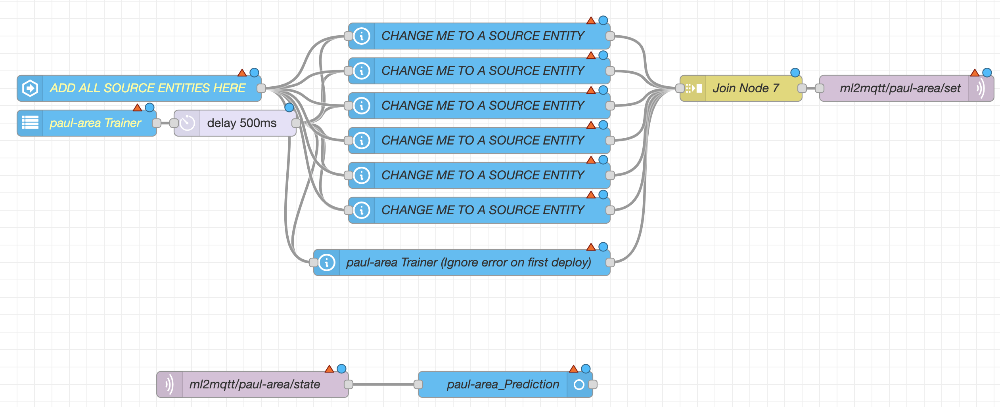

## ML2MQTT

### What is ML2MQTT?

ML2MQTT is a user-friendly machine learning system designed to integrate seamlessly with MQTT. It is tailored for users with minimal programming or machine learning expertise, making it easy to set up while still being powerful. All you need to get started is a basic understanding of MQTT and Node-RED.

### What Problems Does Machine Learning Solve?

Traditional programming relies on fixed sets of rules, which can make it difficult to account for multiple sensors and complex conditions. Machine learning simplifies this by learning from sensor data and automatically identifying patterns. 

For example, in the [Bermuda project](https://github.com/agittins/bermuda), the system determines the location of a phone based on Bluetooth signal strength from multiple sensors. In a traditional logic-based setup, it would simply pick the sensor with the strongest signal. However, machine learning can assess all sensor data at once, identifying more nuanced patterns and providing more accurate predictions. 

With ML2MQTT, you can go even further by defining additional zones that weren’t initially possible in Bermuda’s logic-based system.

### How Does It Work?

Let’s walk through a simple example to illustrate how ML2MQTT works.

**Scenario:**
- You have 6 Bluetooth sensors installed throughout your house.
- You want to track presence in 8 rooms, including a kitchen that currently has no Bluetooth sensor.

**Step 1: Create Your Model**
- Click **Add Model** and enter a name for your model (e.g., "Room Presence") and labels for each room.
- Specify the number of input sensors. This can be adjusted later.

**Step 2: Configure Node-RED**
- Click **Edit** and go to Node-RED. A new flow will be generated for you.
- Click **Copy to Clipboard**, then open Node-RED and import the flow (CTRL+I on Windows or CMD+I on Mac).

Initially, the nodes will look like a jumbled mess. Reorganize them so they are more structured, as shown below:

Before proceeding, it’s important to understand how these nodes work:
- The "ADD ALL SOURCE ENTITIES HERE" node will trigger every time a sensor value changes.
- It will then collect data from each sensor specified in the "Change me to a source entity" nodes.
- Once all sensor values are collected, they are sent to ML2MQTT for processing.

In the example below, we’ve added two sensor entities to the "ADD ALL SOURCE ENTITIES HERE" node:

**Step 3: Configure MQTT in ML2MQTT**
- Go back to ML2MQTT and open the MQTT section.
- Verify that messages are being received. The screen does not auto-refresh, so you may need to click the refresh button a few times.

If no data is appearing, ensure that your sensors are actively sending data. You can also check the Logs panel for any error messages.

**Step 4: Training Your Model**
- Go to the Home Assistant dashboard and add the source entities, the trainer selector, and the prediction sensor.
- Walk around your home and label each room. Select the correct room label on the training selector, and let ML2MQTT record observations.

Once you’ve collected around 1000 observations, you can switch the learning mode from **Eager Learning** to **Lazy Learning**. Lazy Learning will only learn from new observations where the model’s prediction was incorrect, helping to prevent overfitting.

**Step 5: Fine-Tuning Your Model**
- Open the model view and click **Automatically tune model**. This will initiate a tuning process to optimize the model based on your training data.

### Preprocessors and Post Processors

Preprocessors clean data before it is stored in the database and handed to the machine model. Available preprocessors include:

- **Type Caster:** Converts strings (e.g., "unknown") to floats or `None`. Ensure this is the first preprocessor in the list.
- **Null Handler:** Converts `None` values to a placeholder value (e.g., `9999`). This should be the **last** preprocessor in the list.
- **Rolling Average:** Smooths out noisy data by averaging sensor values over a set period.
- **Temporal Expander:** Collects a series of past sensor values and sends them as an array to the ML model.

Coming soon:
- **Time Extractor:** Extracts time-based features (e.g., hour, day of the week) as input to the ML model.

Post Processors clean labels after they are calculated by the ML model, before sending them to MQTT:

- **Only Diff:** Only sends a new label to MQTT if it differs from the previous label.
- **Majority Vote:** (In development) Collects multiple predictions and only sends a label if a majority of votes match.

### Troubleshooting Tips
- If your sensors are not producing data, check that the Node-RED flow is properly configured.
- Ensure that your sensors are consistently sending data to MQTT.
- Keep your labels simple and focused to improve model accuracy.
