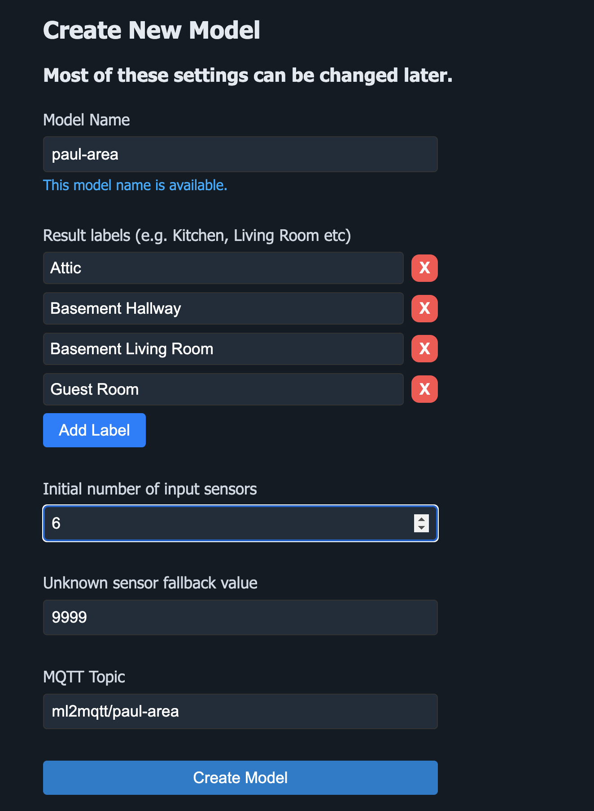

## ML2MQTT

### What is ML2MQTT?

ML2MQTT is a user-friendly machine learning system designed to integrate seamlessly with MQTT. It is tailored for users with minimal programming or machine learning expertise, making it easy to set up while still being powerful. Knowledge of NodeRed and MQTT is required.

### What Problems Does Machine Learning Solve?

Traditional programming relies on fixed sets of rules, which can make it difficult to account for multiple sensors and complex conditions. Machine learning simplifies this by learning from sensor data and automatically identifying patterns. 

For example, in the [Bermuda project](https://github.com/agittins/bermuda), the system determines the location of a phone based on Bluetooth signal strength from multiple sensors. Using a traditional logic-based setup, it simply picks the sensor with the strongest signal to determine the location of a phone. Machine learning can assess all sensor data at once, identifying more nuanced patterns and providing more accurate predictions. 

With ML2MQTT, you can go even further by defining additional zones that weren’t initially possible in Bermuda’s logic-based system.

### How Does It Work?

Let’s walk through a simple example to illustrate how ML2MQTT works.

**Scenario:**
- You have 6 Bluetooth sensors installed throughout your house.
- You want to track presence in 8 rooms.

**Step 0: Install ML2MQTT**
- Navigate to the Addons section of Home Assistant, click on Add-On Store and in the overflow icon at the top right select Repositories.
- Add https://github.com/donutsoft/ml2mqtt as a new repository.
- ML2MQTT should appear in the store.
- Once installed, go to the configuration page of ML2MQTT and ensure the MQTT connection details are set correctly.

Upon launching you should see this window

**Step 1: Create Your Model**
- Click **Add Model** and enter a name for your model (e.g., "Paul-Presence") and add labels for each room.
- Specify the number of input sensors. In my case it's 6.

**Step 2: Configure Node-RED**
- Click **Edit** and go to Node-RED. The source code for a NodeRed flow is automatically created for you.

- Click **Copy to Clipboard**, then open Node-RED. Create a new flow, and import the code from your clipboard (CTRL+I on Windows or CMD+I on Mac).

Initially, the nodes will look like a jumbled mess. Reorganize them so they are more structured, as shown below:

Before proceeding, it’s important to understand how these nodes work:
- The "ADD ALL SOURCE ENTITIES HERE" node will trigger every time a sensor value changes.
- It will then collect data from each sensor specified in the "CHANGE ME TO A SOURCE ENTITY" nodes.
- Once all sensor values are collected, they are sent to ML2MQTT for processing.

This means you have to specify every source entity **twice**. Once in the "CHANGE ME TO A SOURCE ENTITY" node to retrieve its value, and once in the "ADD ALL SOURCE ENTITIES HERE" node to ensure that every time a sensor value changes, all sensor values are sent to ML2MQTT.

In the example below, we’ve added two sensor entities to the "ADD ALL SOURCE ENTITIES HERE" node:

Before saving, click on every node with the Red triangle and configure it for your server. Look for red boxes, those need to be completed before you can proceed. 

You'll still have one red triangle for the Trainer node (that's labeled Ignore error on first deploy). This is because it's referencing a node that hasn't been added to Home Assistant yet, but once you deploy this should go away.

**Step 3: Configure MQTT in ML2MQTT**
- Go back to ML2MQTT and open the MQTT section.
- Verify that messages are being received. The screen does not auto-refresh, so you may need to click the refresh button a few times.

If no data is appearing, ensure that your sensors are actively sending data. You can also check the Logs panel for any error messages.

**Step 4: Training Your Model**
- Go to the Home Assistant dashboard and add the source entities, the trainer selector, and the prediction sensor.
- Walk around your home and label each room. Select the correct room label on the training selector, and let ML2MQTT record observations. When you're about to change rooms, select disabled first and only start training once you're in the new room to avoid conflicting labels.

Once you’ve collected around 1000 observations, you can switch the learning mode from **Eager Learning** to **Lazy Learning**. Lazy Learning will only learn from new observations where the model’s prediction was incorrect, helping to preserve disk space and memory.

**Step 5: Fine-Tuning Your Model**
- Once you have an adequately sized dataset, open the model view and click **Automatically tune model**. This will initiate a tuning process to optimize the model based on your training data.

### Preprocessors and Post Processors

#### Preprocessors clean data before it is stored in the database and handed to the machine model. Available preprocessors include:

- **Type Caster:** Converts strings (e.g., "unknown") to floats or `None`. Ensure this is the first preprocessor in the list.
- **Null Handler:** Converts `None` values to a placeholder value (e.g., `9999`). This should be the **last** preprocessor in the list.
- **Rolling Average:** Smooths out noisy data by averaging sensor values over a set period.
- **Temporal Expander:** Collects a series of past sensor values and sends them as an array to the ML model.

Coming soon:
- **Time Extractor:** Extracts time-based features (e.g., hour, day of the week) as input to the ML model.

#### Post Processors clean labels after they are calculated by the ML model, before sending them to MQTT:

- **Only Diff:** Only sends a new label to MQTT if it differs from the previous label.
- **Majority Vote:** (In development) Collects multiple predictions and only sends a label if a majority of votes match.

Coming soon:
- **Reinforcement learner:** If a series of results look like [Room1, Room1, Room2, Room1, Room1], the model will automatically learn that Room2 should have been Room1.

### Troubleshooting Tips
- Ensure that your sensors are consistently sending data to MQTT. The NodeRed debug node can help with this.
- Keep your labels simple and focused to improve model accuracy. The higher the number of labels, the greater the likelihood of an incorrect guess.
- If you find your results are noisy (e.g. labels jumping back and forth), just train further in that area.
- If training is too slow, be aware you can change the BLE broadcast frequency in the home assistant app at the expense of increased battery usage. For training this will work fine.
- If you forget to disable the training mode, there's the option to delete results of different time durations under the Observations menu.